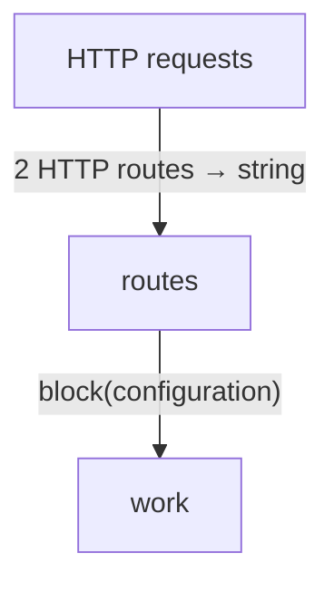
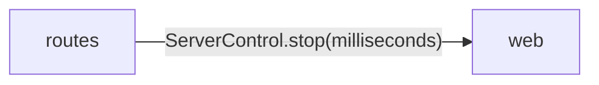
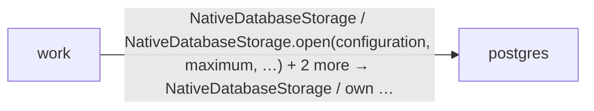

<!-- Generated by aug spec. Edit the August source, then regenerate. -->

# Project diagrams

Start here to see what moves between the application’s folders. Each arrow names an operation’s inputs and the result it returns to its caller. Open a folder for the next level of detail. Expand the contract list for complete types and dependency links.

## Data flow

### Package boundaries

routes package calls

work package calls

Data crossing these boundaries (8 contracts)

| From | To | Operation and inputs | Result |
| --- | --- | --- | --- |
| HTTP requests | routes | [POST /slow](../../routes.aug.md#symbol-slow) · request: HttpRequest from request · HTTP endpoint | string |
| HTTP requests | routes | [POST /stop](../../routes.aug.md#symbol-stop) · HTTP endpoint | string |
| routes | web | [ServerControl.stop](../packages/%40git/url_897efafd565158fc4908/0.0.0-git.7f5357813b6f84848c358a1d8846a1a08b2c0608/contracts.aug.md#symbol-ServerControl.stop) · milliseconds: int · interface dispatch | void |
| routes | work | [block](../../work.aug.md#symbol-block) · configuration: string | void |
| work | postgres | [NativeDatabaseStorage](../packages/%40greenpandastudios/aug-postgres/0.2.0/api.aug.md#symbol-NativeDatabaseStorage) | NativeDatabaseStorage |
| work | postgres | [NativeDatabaseStorage.open](../packages/%40greenpandastudios/aug-postgres/0.2.0/api.aug.md#symbol-NativeDatabaseStorage.open) · configuration: string, maximum: int, connectMilliseconds: int, cleanupMilliseconds: int | own Pool |
| work | postgres | [acquire](../packages/%40greenpandastudios/aug-postgres/0.2.0/api.aug.md#symbol-acquire) · pool: borrow Pool | own Connection |
| work | postgres | [query](../packages/%40greenpandastudios/aug-postgres/0.2.0/api.aug.md#symbol-query) · connection: borrow Connection, sql: string, parameters: List\<string\>, milliseconds: int, maximumRows: int, maximumBytes: int | own Result |

## Open a module

| Module | Read |
| --- | --- |
| main.aug | [Flow and sequences](../../main.aug.diagrams.md) · [Explanation](../../main.aug.md) |
| routes.aug | [Flow and sequences](../../routes.aug.diagrams.md) · [Explanation](../../routes.aug.md) |
| work.aug | [Flow and sequences](../../work.aug.diagrams.md) · [Explanation](../../work.aug.md) |

These are static call boundaries, not a request trace. Interface implementations and foreign internals stop at their checked contracts. Dotted arrows defer a callback or browser action. Imports alone do not imply a call.

## HTTP APIs

| API | Operation |
| --- | --- |
| POST /slow | [slow](../../routes.aug.diagrams.md#sequence-slow) |
| POST /stop | [stop](../../routes.aug.diagrams.md#sequence-stop) |
