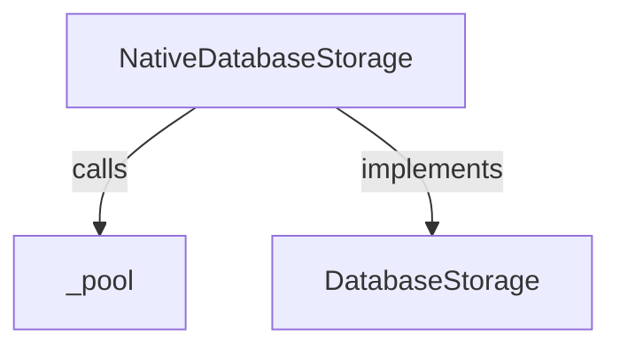
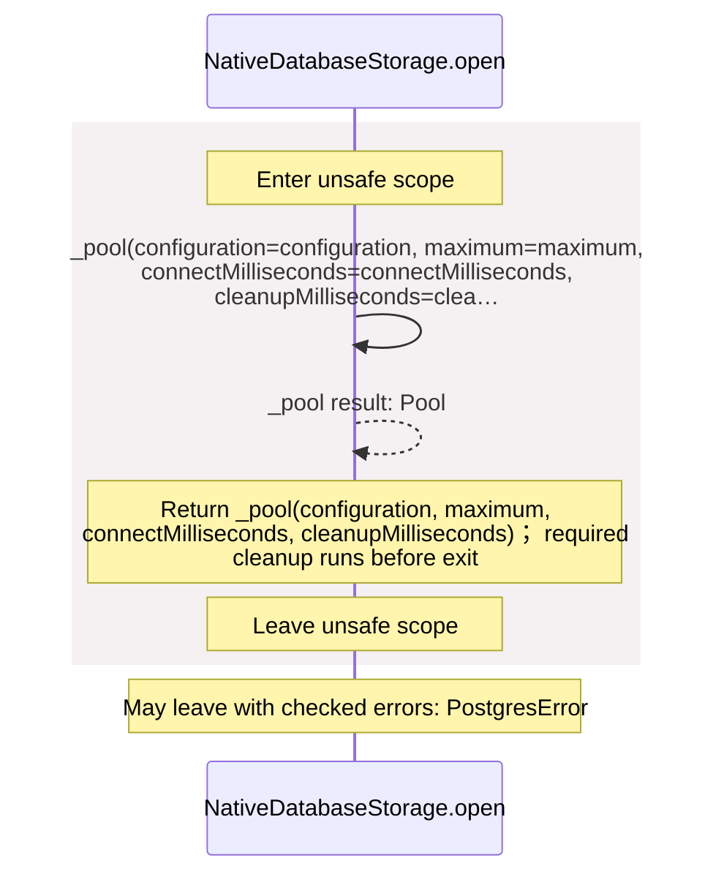
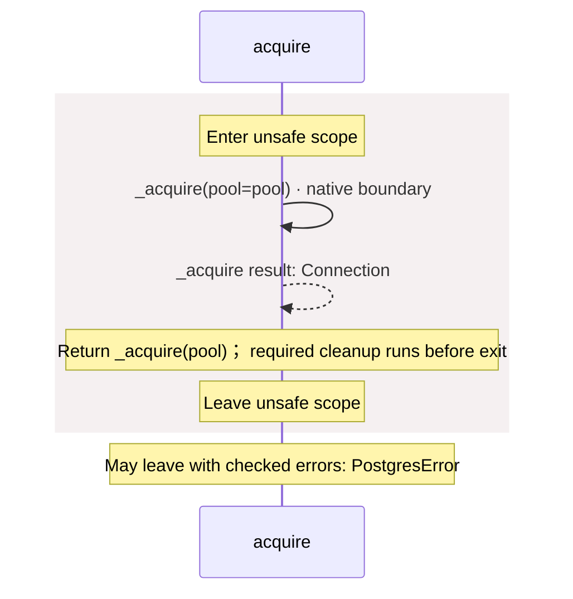
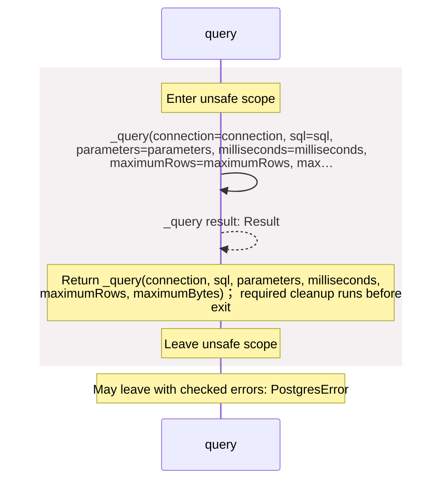
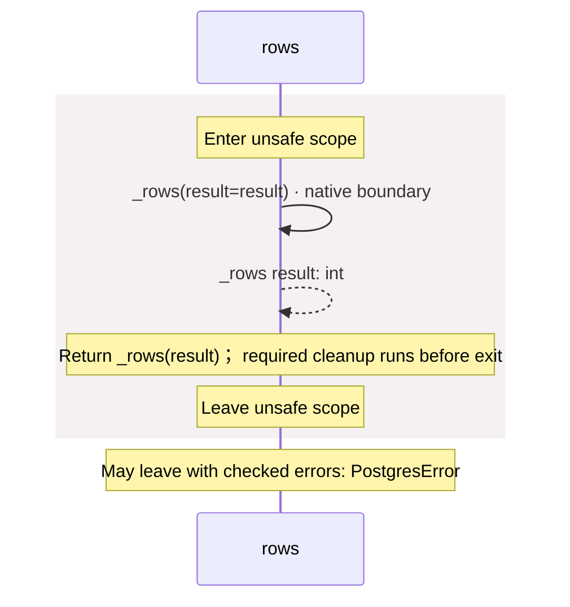
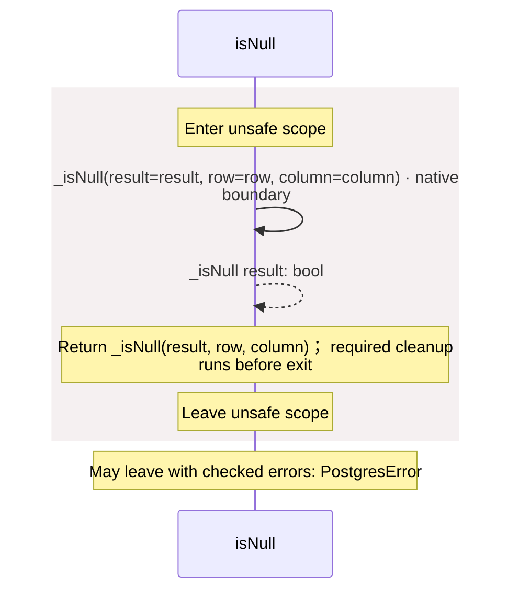
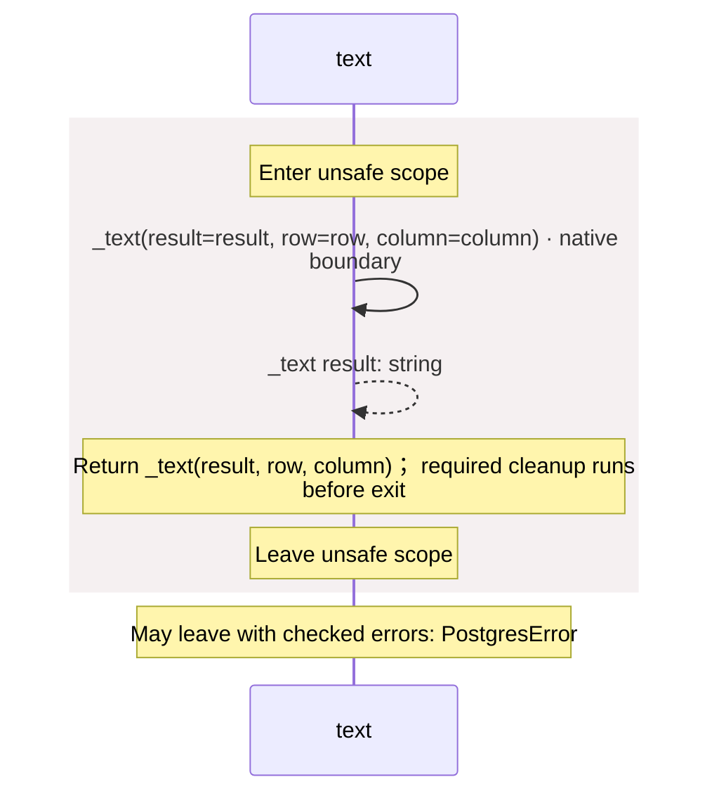
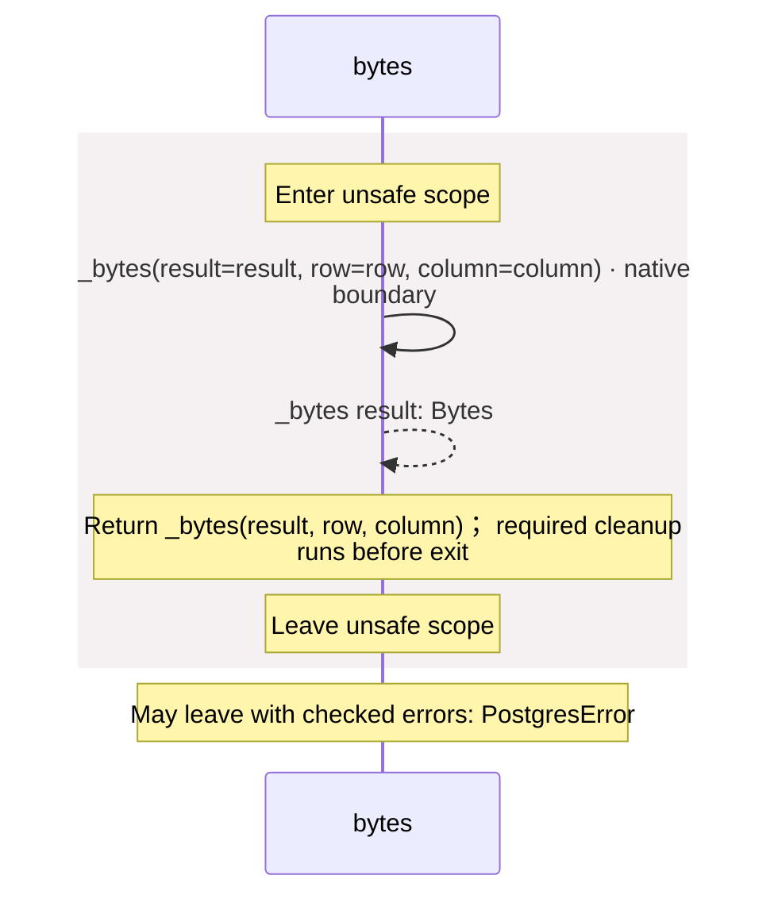
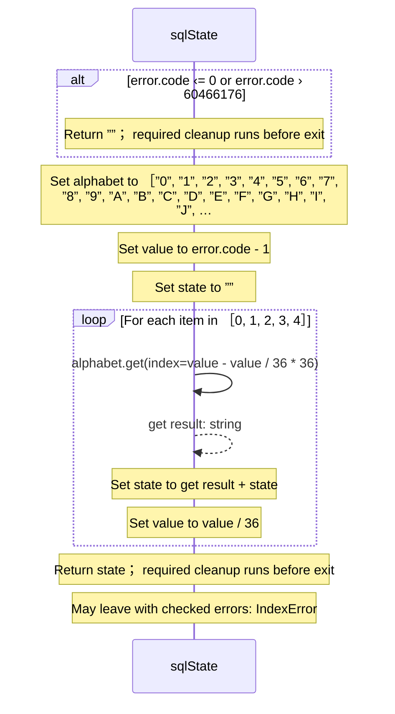

<!-- Generated by aug spec. Edit the August source, then regenerate. -->

# package/@greenpandastudios/aug-postgres@0.2.0/api.aug diagrams

[Project overview](../../../../diagrams/index.md) · [Compiled explanation](api.aug.md)

## Class interactions

## Sequences

Call arrows identify checked targets; loop and branch frames determine when they run. Open that target’s module to follow its implementation. Branches describe alternatives; loops describe repeated work. Native calls and interface dispatch stop at their declared contracts. Exit notes end that path; enclosing recovery and cleanup remain visible.

### \_pool

[Source](api.aug#L5)

May leave with checked errors: PostgresError. Native implementation; only the declared contract is known. [Explanation](api.aug.md).

### \_acquire

[Source](api.aug#L6)

May leave with checked errors: PostgresError. Native implementation; only the declared contract is known. [Explanation](api.aug.md).

### \_query

[Source](api.aug#L7)

May leave with checked errors: PostgresError. Native implementation; only the declared contract is known. [Explanation](api.aug.md).

### \_rows

[Source](api.aug#L8)

May leave with checked errors: PostgresError. Native implementation; only the declared contract is known. [Explanation](api.aug.md).

### \_isNull

[Source](api.aug#L9)

May leave with checked errors: PostgresError. Native implementation; only the declared contract is known. [Explanation](api.aug.md).

### \_text

[Source](api.aug#L10)

May leave with checked errors: PostgresError. Native implementation; only the declared contract is known. [Explanation](api.aug.md).

### \_bytes

[Source](api.aug#L11)

May leave with checked errors: PostgresError. Native implementation; only the declared contract is known. [Explanation](api.aug.md).

### NativeDatabaseStorage constructor

[Source](api.aug#L13)

[Explanation](api.aug.md).

### NativeDatabaseStorage.open

[Source](api.aug#L14)

### acquire

[Source](api.aug#L18)

### query

[Source](api.aug#L22)

### rows

[Source](api.aug#L26)

### isNull

[Source](api.aug#L30)

### text

[Source](api.aug#L34)

### bytes

[Source](api.aug#L38)

### sqlState

[Source](api.aug#L42)

## Called contracts

- [\_acquire](api.aug.diagrams.md#sequence-_acquire) — package/@greenpandastudios/aug-postgres@0.2.0/api.aug
- [\_bytes](api.aug.diagrams.md#sequence-_bytes) — package/@greenpandastudios/aug-postgres@0.2.0/api.aug
- [\_isNull](api.aug.diagrams.md#sequence-_isNull) — package/@greenpandastudios/aug-postgres@0.2.0/api.aug
- [\_pool](api.aug.diagrams.md#sequence-_pool) — package/@greenpandastudios/aug-postgres@0.2.0/api.aug
- [\_query](api.aug.diagrams.md#sequence-_query) — package/@greenpandastudios/aug-postgres@0.2.0/api.aug
- [\_rows](api.aug.diagrams.md#sequence-_rows) — package/@greenpandastudios/aug-postgres@0.2.0/api.aug
- [\_text](api.aug.diagrams.md#sequence-_text) — package/@greenpandastudios/aug-postgres@0.2.0/api.aug
- [DatabaseStorage](contracts.aug.diagrams.md) — package/@greenpandastudios/aug-postgres@0.2.0/contracts.aug
