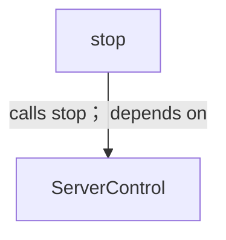
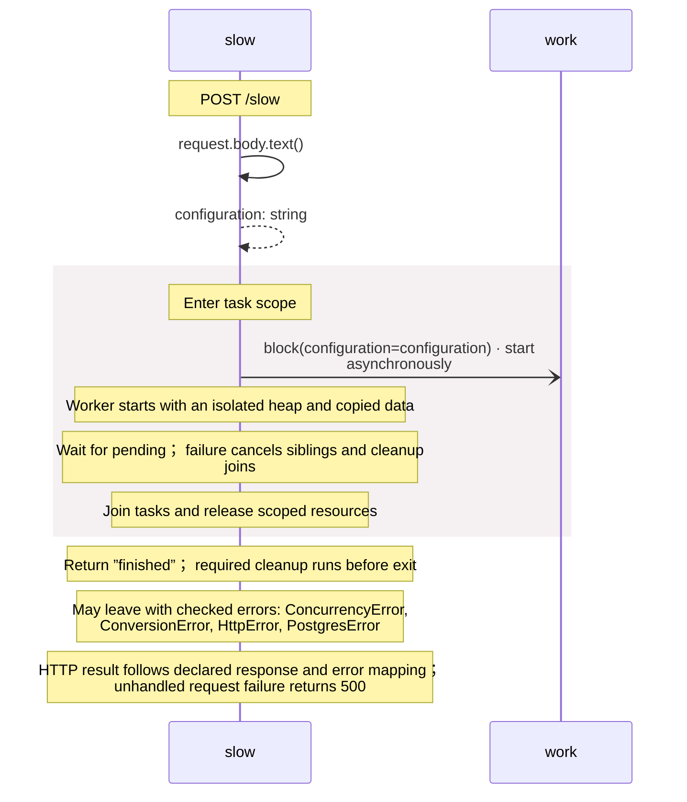
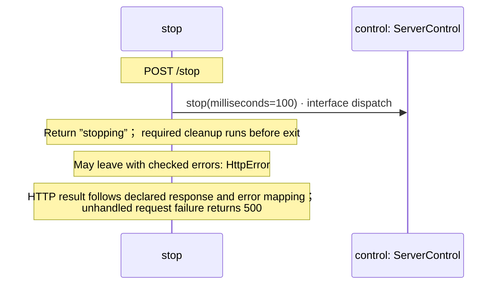

<!-- Generated by aug spec. Edit the August source, then regenerate. -->

# routes.aug diagrams

[Project overview](.aug-spec/diagrams/index.md) · [Compiled explanation](routes.aug.md)

## Class interactions

## Sequences

Call arrows identify checked targets; loop and branch frames determine when they run. Open that target’s module to follow its implementation. Branches describe alternatives; loops describe repeated work. Native calls and interface dispatch stop at their declared contracts. Exit notes end that path; enclosing recovery and cleanup remain visible.

### slow

[Source](routes.aug#L5)

### stop

[Source](routes.aug#L11)

## Called contracts

- [ServerControl](.aug-spec/packages/%40git/url_897efafd565158fc4908/0.0.0-git.7f5357813b6f84848c358a1d8846a1a08b2c0608/contracts.aug.diagrams.md) — package/@git/url\_897efafd565158fc4908@0.0.0-git.7f5357813b6f84848c358a1d8846a1a08b2c0608/contracts.aug
- [ServerControl.stop](.aug-spec/packages/%40git/url_897efafd565158fc4908/0.0.0-git.7f5357813b6f84848c358a1d8846a1a08b2c0608/contracts.aug.diagrams.md#sequence-ServerControl.stop) — package/@git/url\_897efafd565158fc4908@0.0.0-git.7f5357813b6f84848c358a1d8846a1a08b2c0608/contracts.aug
- [block](work.aug.diagrams.md#sequence-block) — work.aug
