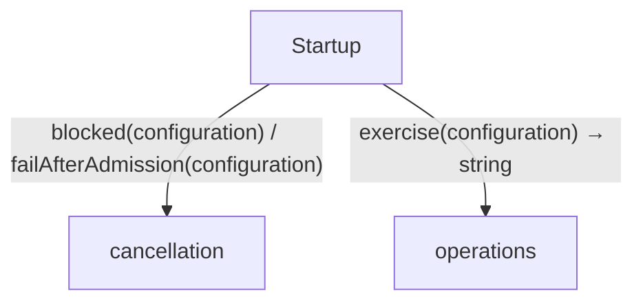
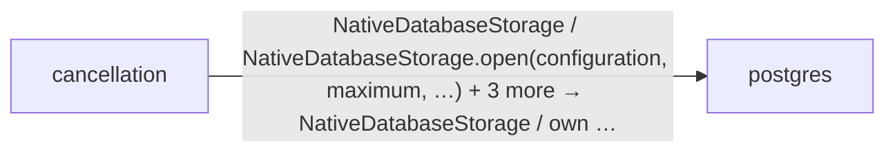
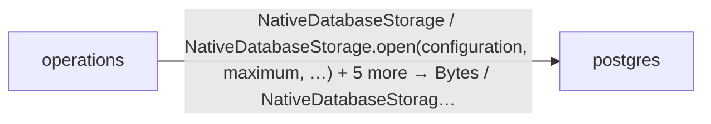

<!-- Generated by aug spec. Edit the August source, then regenerate. -->

# Project diagrams

Start here to see what moves between the application’s folders. Each arrow names an operation’s inputs and the result it returns to its caller. Open a folder for the next level of detail. Expand the contract list for complete types and dependency links.

## Data flow

### Package boundaries

cancellation package calls

operations package calls

Data crossing these boundaries (17 contracts)

| From | To | Operation and inputs | Result |
| --- | --- | --- | --- |
| cancellation | postgres | [NativeDatabaseStorage](../packages/%40greenpandastudios/aug-postgres/0.2.0/api.aug.md#symbol-NativeDatabaseStorage) | NativeDatabaseStorage |
| cancellation | postgres | [NativeDatabaseStorage.open](../packages/%40greenpandastudios/aug-postgres/0.2.0/api.aug.md#symbol-NativeDatabaseStorage.open) · configuration: string, maximum: int, connectMilliseconds: int, cleanupMilliseconds: int | own Pool |
| cancellation | postgres | [PostgresError](../packages/%40greenpandastudios/aug-postgres/0.2.0/contracts.aug.md#symbol-PostgresError) · code: int, message: string · value construction | PostgresError |
| cancellation | postgres | [acquire](../packages/%40greenpandastudios/aug-postgres/0.2.0/api.aug.md#symbol-acquire) · pool: borrow Pool | own Connection |
| cancellation | postgres | [query](../packages/%40greenpandastudios/aug-postgres/0.2.0/api.aug.md#symbol-query) · connection: borrow Connection, sql: string, parameters: List\<string\>, milliseconds: int, maximumRows: int, maximumBytes: int | own Result |
| cancellation | postgres | [text](../packages/%40greenpandastudios/aug-postgres/0.2.0/api.aug.md#symbol-text) · result: Result, row: int, column: int | string |
| Startup | cancellation | [blocked](../../cancellation.aug.md#symbol-blocked) · configuration: string | void |
| Startup | cancellation | [failAfterAdmission](../../cancellation.aug.md#symbol-failAfterAdmission) · configuration: string | void |
| Startup | operations | [exercise](../../operations.aug.md#symbol-exercise) · configuration: string | string |
| operations | postgres | [NativeDatabaseStorage](../packages/%40greenpandastudios/aug-postgres/0.2.0/api.aug.md#symbol-NativeDatabaseStorage) | NativeDatabaseStorage |
| operations | postgres | [NativeDatabaseStorage.open](../packages/%40greenpandastudios/aug-postgres/0.2.0/api.aug.md#symbol-NativeDatabaseStorage.open) · configuration: string, maximum: int, connectMilliseconds: int, cleanupMilliseconds: int | own Pool |
| operations | postgres | [PostgresError](../packages/%40greenpandastudios/aug-postgres/0.2.0/contracts.aug.md#symbol-PostgresError) · code: int, message: string · value construction | PostgresError |
| operations | postgres | [acquire](../packages/%40greenpandastudios/aug-postgres/0.2.0/api.aug.md#symbol-acquire) · pool: borrow Pool | own Connection |
| operations | postgres | [bytes](../packages/%40greenpandastudios/aug-postgres/0.2.0/api.aug.md#symbol-bytes) · result: Result, row: int, column: int | Bytes |
| operations | postgres | [query](../packages/%40greenpandastudios/aug-postgres/0.2.0/api.aug.md#symbol-query) · connection: borrow Connection, sql: string, parameters: List\<string\>, milliseconds: int, maximumRows: int, maximumBytes: int | own Result |
| operations | postgres | [rows](../packages/%40greenpandastudios/aug-postgres/0.2.0/api.aug.md#symbol-rows) · result: Result | int |
| operations | postgres | [sqlState](../packages/%40greenpandastudios/aug-postgres/0.2.0/api.aug.md#symbol-sqlState) · error: PostgresError | string |

## Open a module

| Module | Read |
| --- | --- |
| cancellation.aug | [Flow and sequences](../../cancellation.aug.diagrams.md) · [Explanation](../../cancellation.aug.md) |
| main.aug | [Flow and sequences](../../main.aug.diagrams.md) · [Explanation](../../main.aug.md) |
| operations.aug | [Flow and sequences](../../operations.aug.diagrams.md) · [Explanation](../../operations.aug.md) |

These are static call boundaries, not a request trace. Interface implementations and foreign internals stop at their checked contracts. Dotted arrows defer a callback or browser action. Imports alone do not imply a call.
