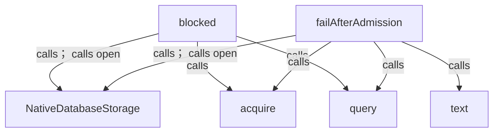
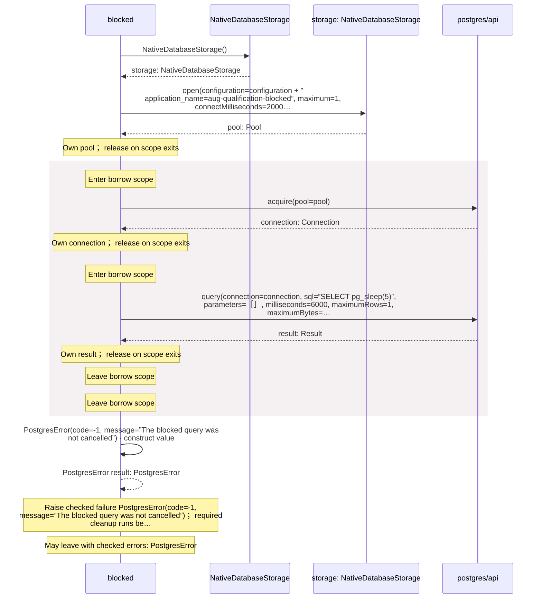
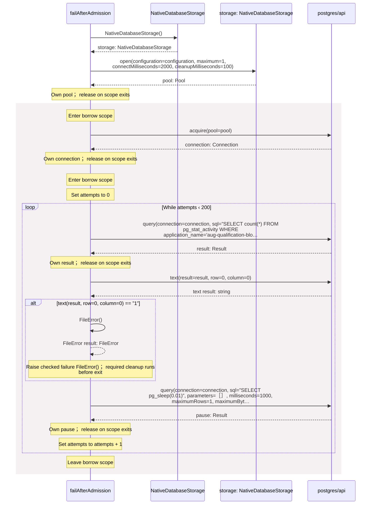
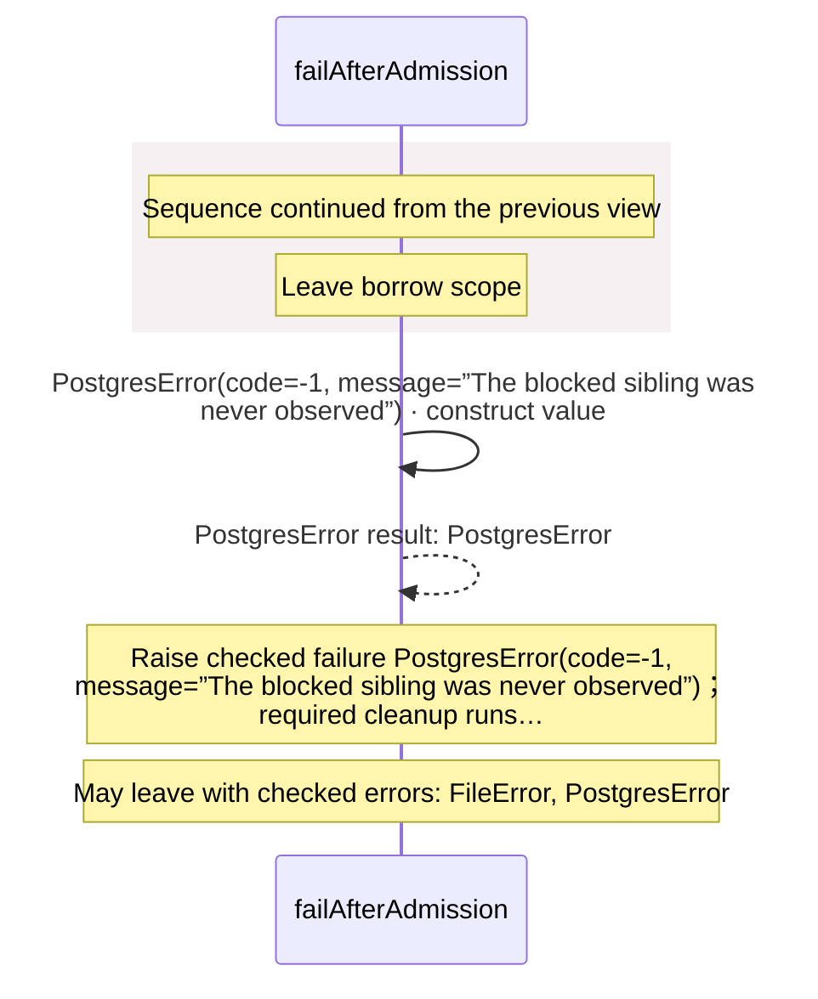

<!-- Generated by aug spec. Edit the August source, then regenerate. -->

# cancellation.aug diagrams

[Project overview](.aug-spec/diagrams/index.md) · [Compiled explanation](cancellation.aug.md)

## Class interactions

## Sequences

Call arrows identify checked targets; loop and branch frames determine when they run. Open that target’s module to follow its implementation. Branches describe alternatives; loops describe repeated work. Native calls and interface dispatch stop at their declared contracts. Exit notes end that path; enclosing recovery and cleanup remain visible.

### blocked

[Source](cancellation.aug#L5)

### failAfterAdmission

[Source](cancellation.aug#L15)

#### Sequence 1 of 2

#### Sequence 2 of 2 (continued)

## Called contracts

- [NativeDatabaseStorage](.aug-spec/packages/%40greenpandastudios/aug-postgres/0.2.0/api.aug.diagrams.md#sequence-NativeDatabaseStorage-20-constructor) — package/@greenpandastudios/aug-postgres@0.2.0/api.aug
- [NativeDatabaseStorage.open](.aug-spec/packages/%40greenpandastudios/aug-postgres/0.2.0/api.aug.diagrams.md#sequence-NativeDatabaseStorage.open) — package/@greenpandastudios/aug-postgres@0.2.0/api.aug
- [acquire](.aug-spec/packages/%40greenpandastudios/aug-postgres/0.2.0/api.aug.diagrams.md#sequence-acquire) — package/@greenpandastudios/aug-postgres@0.2.0/api.aug
- [query](.aug-spec/packages/%40greenpandastudios/aug-postgres/0.2.0/api.aug.diagrams.md#sequence-query) — package/@greenpandastudios/aug-postgres@0.2.0/api.aug
- [text](.aug-spec/packages/%40greenpandastudios/aug-postgres/0.2.0/api.aug.diagrams.md#sequence-text) — package/@greenpandastudios/aug-postgres@0.2.0/api.aug
- [PostgresError](.aug-spec/packages/%40greenpandastudios/aug-postgres/0.2.0/contracts.aug.diagrams.md#sequence-PostgresError-20-constructor) — package/@greenpandastudios/aug-postgres@0.2.0/contracts.aug
