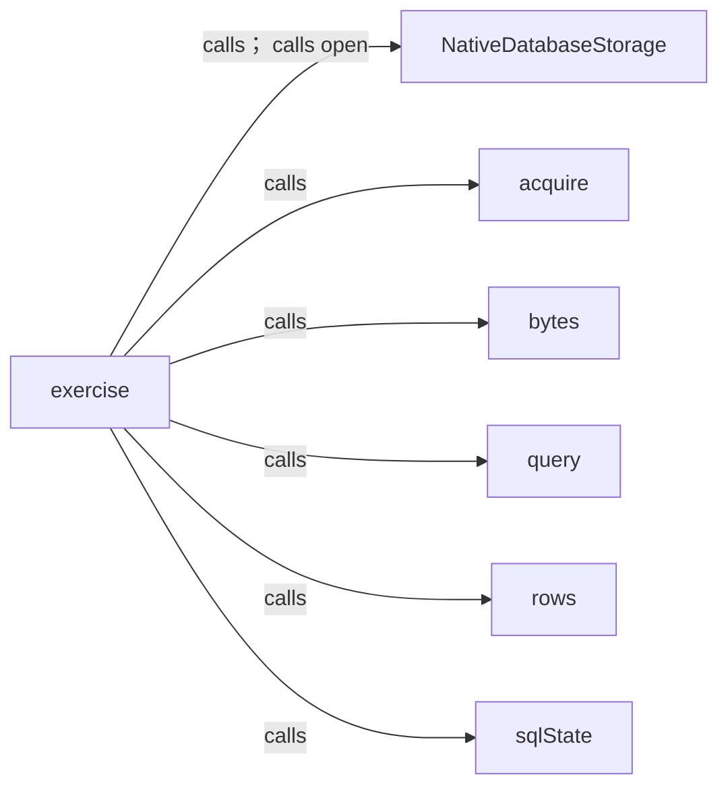
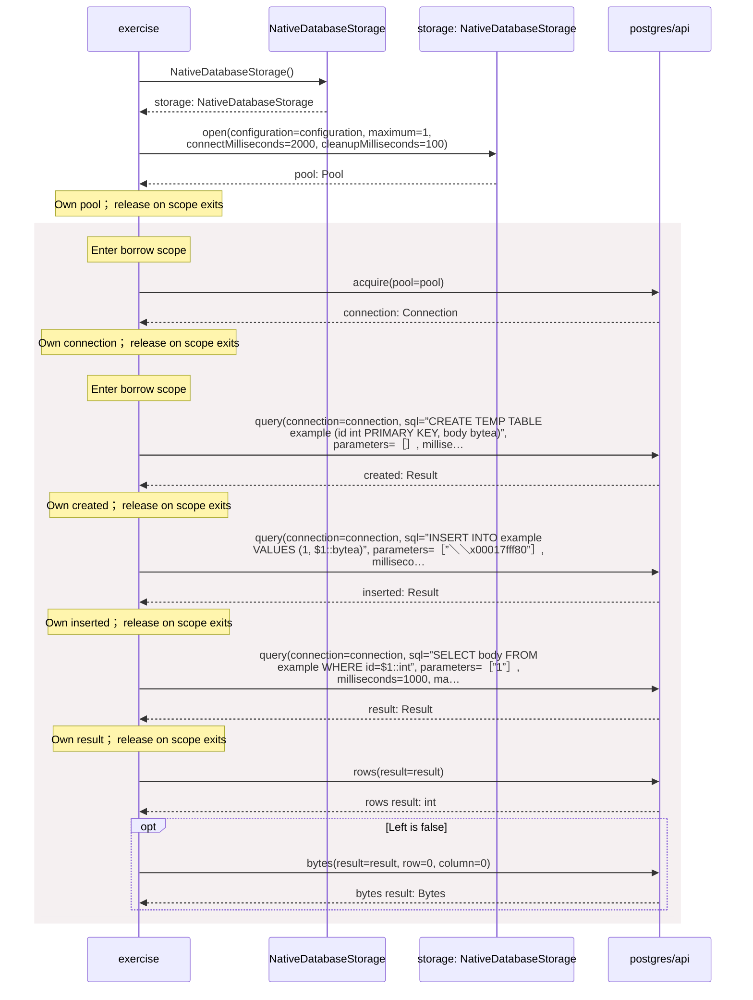
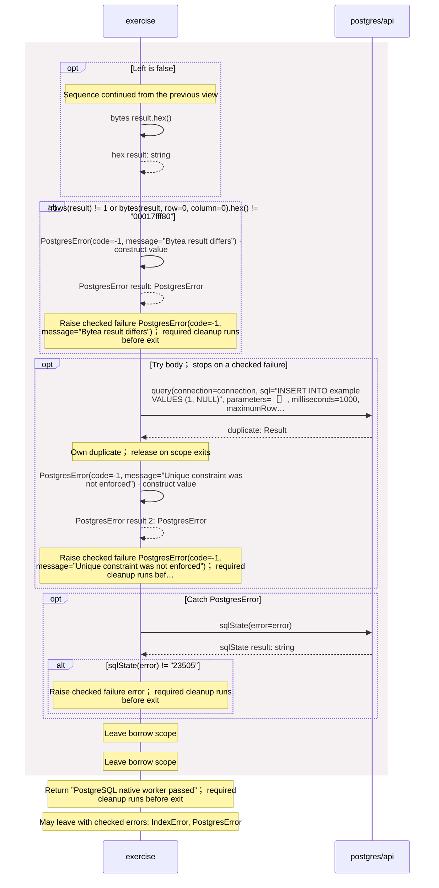

<!-- Generated by aug spec. Edit the August source, then regenerate. -->

# operations.aug diagrams

[Project overview](.aug-spec/diagrams/index.md) · [Compiled explanation](operations.aug.md)

## Class interactions

### exercise

## Sequences

Call arrows identify checked targets; loop and branch frames determine when they run. Open that target’s module to follow its implementation. Branches describe alternatives; loops describe repeated work. Native calls and interface dispatch stop at their declared contracts. Exit notes end that path; enclosing recovery and cleanup remain visible.

### exercise

[Source](operations.aug#L4)

#### Sequence 1 of 2

#### Sequence 2 of 2 (continued)

## Called contracts

- [NativeDatabaseStorage](.aug-spec/packages/%40greenpandastudios/aug-postgres/0.2.0/api.aug.diagrams.md#sequence-NativeDatabaseStorage-20-constructor) — package/@greenpandastudios/aug-postgres@0.2.0/api.aug
- [NativeDatabaseStorage.open](.aug-spec/packages/%40greenpandastudios/aug-postgres/0.2.0/api.aug.diagrams.md#sequence-NativeDatabaseStorage.open) — package/@greenpandastudios/aug-postgres@0.2.0/api.aug
- [acquire](.aug-spec/packages/%40greenpandastudios/aug-postgres/0.2.0/api.aug.diagrams.md#sequence-acquire) — package/@greenpandastudios/aug-postgres@0.2.0/api.aug
- [bytes](.aug-spec/packages/%40greenpandastudios/aug-postgres/0.2.0/api.aug.diagrams.md#sequence-bytes) — package/@greenpandastudios/aug-postgres@0.2.0/api.aug
- [query](.aug-spec/packages/%40greenpandastudios/aug-postgres/0.2.0/api.aug.diagrams.md#sequence-query) — package/@greenpandastudios/aug-postgres@0.2.0/api.aug
- [rows](.aug-spec/packages/%40greenpandastudios/aug-postgres/0.2.0/api.aug.diagrams.md#sequence-rows) — package/@greenpandastudios/aug-postgres@0.2.0/api.aug
- [sqlState](.aug-spec/packages/%40greenpandastudios/aug-postgres/0.2.0/api.aug.diagrams.md#sequence-sqlState) — package/@greenpandastudios/aug-postgres@0.2.0/api.aug
- [PostgresError](.aug-spec/packages/%40greenpandastudios/aug-postgres/0.2.0/contracts.aug.diagrams.md#sequence-PostgresError-20-constructor) — package/@greenpandastudios/aug-postgres@0.2.0/contracts.aug
